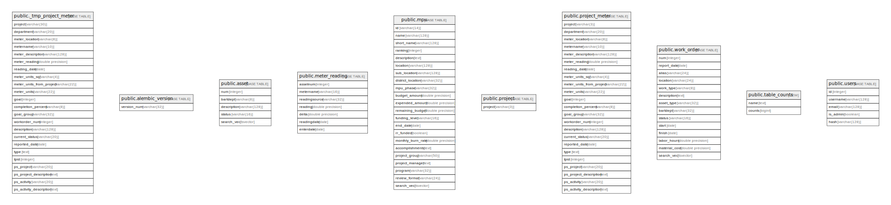

# bart_dashboard

## Tables

| Name | Columns | Comment | Type |
| ---- | ------- | ------- | ---- |
| [public._tmp_project_meter](public._tmp_project_meter.md) | 23 |  | BASE TABLE |
| [public.alembic_version](public.alembic_version.md) | 1 |  | BASE TABLE |
| [public.asset](public.asset.md) | 5 |  | BASE TABLE |
| [public.meter_reading](public.meter_reading.md) | 7 |  | BASE TABLE |
| [public.mpu](public.mpu.md) | 22 |  | BASE TABLE |
| [public.project](public.project.md) | 1 |  | BASE TABLE |
| [public.project_meter](public.project_meter.md) | 23 |  | BASE TABLE |
| [public.work_order](public.work_order.md) | 14 |  | BASE TABLE |
| [public.table_counts](public.table_counts.md) | 2 |  | VIEW |
| [public.users](public.users.md) | 5 |  | BASE TABLE |

## Relations

---

> Generated by [tbls](https://github.com/k1LoW/tbls)
