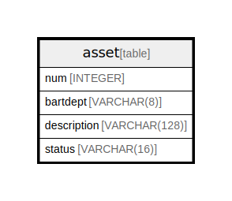

# asset

## Description

<details>
<summary><strong>Table Definition</strong></summary>

```sql
CREATE TABLE asset (
	num INTEGER NOT NULL, 
	bartdept VARCHAR(8), 
	description VARCHAR(128), 
	status VARCHAR(16), 
	PRIMARY KEY (num)
)
```

</details>

## Columns

| Name | Type | Default | Nullable | Children | Parents | Comment |
| ---- | ---- | ------- | -------- | -------- | ------- | ------- |
| num | INTEGER |  | false |  |  |  |
| bartdept | VARCHAR(8) |  | true |  |  |  |
| description | VARCHAR(128) |  | true |  |  |  |
| status | VARCHAR(16) |  | true |  |  |  |

## Constraints

| Name | Type | Definition |
| ---- | ---- | ---------- |
| num | PRIMARY KEY | PRIMARY KEY (num) |

## Relations



---

> Generated by [tbls](https://github.com/k1LoW/tbls)
