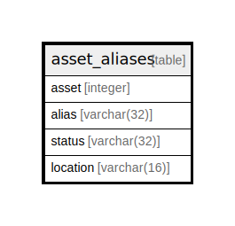

# asset_aliases

## Description

<details>
<summary><strong>Table Definition</strong></summary>

```sql
CREATE TABLE asset_aliases (
    asset integer,
    alias varchar(32),
    status varchar(32),
    location varchar(16)
)
```

</details>

## Columns

| Name | Type | Default | Nullable | Children | Parents | Comment |
| ---- | ---- | ------- | -------- | -------- | ------- | ------- |
| asset | integer |  | true |  |  |  |
| alias | varchar(32) |  | true |  |  |  |
| status | varchar(32) |  | true |  |  |  |
| location | varchar(16) |  | true |  |  |  |

## Relations



---

> Generated by [tbls](https://github.com/k1LoW/tbls)
