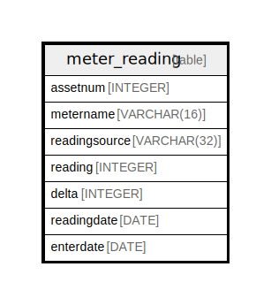

# meter_reading

## Description

<details>
<summary><strong>Table Definition</strong></summary>

```sql
CREATE TABLE meter_reading (
	assetnum INTEGER NOT NULL, 
	metername VARCHAR(16) NOT NULL, 
	readingsource VARCHAR(32) NOT NULL, 
	reading INTEGER NOT NULL, 
	delta INTEGER NOT NULL, 
	readingdate DATE NOT NULL, 
	enterdate DATE NOT NULL, 
	PRIMARY KEY (assetnum, metername, readingsource, reading, delta, readingdate, enterdate)
)
```

</details>

## Columns

| Name | Type | Default | Nullable | Children | Parents | Comment |
| ---- | ---- | ------- | -------- | -------- | ------- | ------- |
| assetnum | INTEGER |  | false |  |  |  |
| metername | VARCHAR(16) |  | false |  |  |  |
| readingsource | VARCHAR(32) |  | false |  |  |  |
| reading | INTEGER |  | false |  |  |  |
| delta | INTEGER |  | false |  |  |  |
| readingdate | DATE |  | false |  |  |  |
| enterdate | DATE |  | false |  |  |  |

## Constraints

| Name | Type | Definition |
| ---- | ---- | ---------- |
| assetnum | PRIMARY KEY | PRIMARY KEY (assetnum) |
| metername | PRIMARY KEY | PRIMARY KEY (metername) |
| readingsource | PRIMARY KEY | PRIMARY KEY (readingsource) |
| reading | PRIMARY KEY | PRIMARY KEY (reading) |
| delta | PRIMARY KEY | PRIMARY KEY (delta) |
| readingdate | PRIMARY KEY | PRIMARY KEY (readingdate) |
| enterdate | PRIMARY KEY | PRIMARY KEY (enterdate) |
| sqlite_autoindex_meter_reading_1 | PRIMARY KEY | PRIMARY KEY (assetnum, metername, readingsource, reading, delta, readingdate, enterdate) |

## Indexes

| Name | Definition |
| ---- | ---------- |
| sqlite_autoindex_meter_reading_1 | PRIMARY KEY (assetnum, metername, readingsource, reading, delta, readingdate, enterdate) |

## Relations



---

> Generated by [tbls](https://github.com/k1LoW/tbls)
