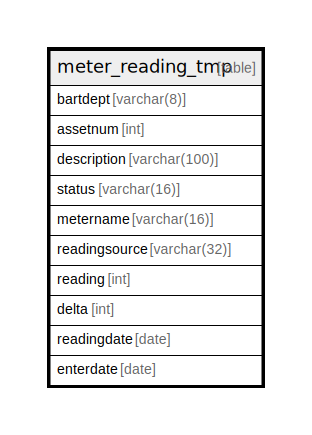

# meter_reading_tmp

## Description

<details>
<summary><strong>Table Definition</strong></summary>

```sql
CREATE TABLE meter_reading_tmp (
    bartdept      varchar(8),
    assetnum      int,
    description   varchar(100),
    status        varchar(16),
    metername     varchar(16),
    readingsource varchar(32),
    reading       int,
    delta         int,
    readingdate   date,
    enterdate     date
)
```

</details>

## Columns

| Name | Type | Default | Nullable | Children | Parents | Comment |
| ---- | ---- | ------- | -------- | -------- | ------- | ------- |
| bartdept | varchar(8) |  | true |  |  |  |
| assetnum | int |  | true |  |  |  |
| description | varchar(100) |  | true |  |  |  |
| status | varchar(16) |  | true |  |  |  |
| metername | varchar(16) |  | true |  |  |  |
| readingsource | varchar(32) |  | true |  |  |  |
| reading | int |  | true |  |  |  |
| delta | int |  | true |  |  |  |
| readingdate | date |  | true |  |  |  |
| enterdate | date |  | true |  |  |  |

## Relations



---

> Generated by [tbls](https://github.com/k1LoW/tbls)
