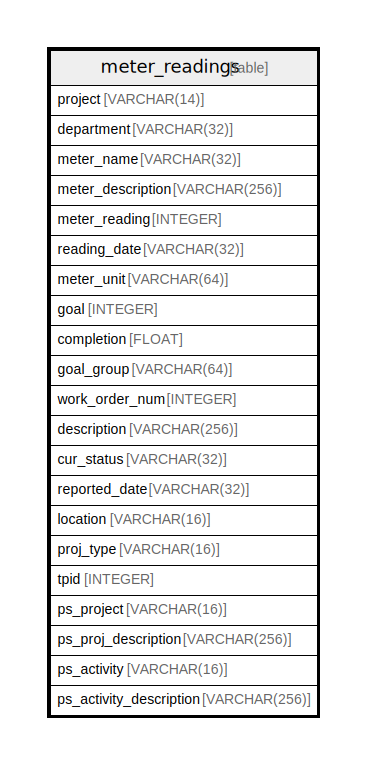

# meter_readings

## Description

<details>
<summary><strong>Table Definition</strong></summary>

```sql
CREATE TABLE meter_readings (
	project VARCHAR(14) NOT NULL, 
	department VARCHAR(32), 
	meter_name VARCHAR(32), 
	meter_description VARCHAR(256), 
	meter_reading INTEGER, 
	reading_date VARCHAR(32), 
	meter_unit VARCHAR(64), 
	goal INTEGER, 
	completion FLOAT, 
	goal_group VARCHAR(64), 
	work_order_num INTEGER, 
	description VARCHAR(256), 
	cur_status VARCHAR(32), 
	reported_date VARCHAR(32), 
	location VARCHAR(16), 
	proj_type VARCHAR(16), 
	tpid INTEGER, 
	ps_project VARCHAR(16), 
	ps_proj_description VARCHAR(256), 
	ps_activity VARCHAR(16), 
	ps_activity_description VARCHAR(256), 
	PRIMARY KEY (project)
)
```

</details>

## Columns

| Name | Type | Default | Nullable | Children | Parents | Comment |
| ---- | ---- | ------- | -------- | -------- | ------- | ------- |
| project | VARCHAR(14) |  | false |  |  |  |
| department | VARCHAR(32) |  | true |  |  |  |
| meter_name | VARCHAR(32) |  | true |  |  |  |
| meter_description | VARCHAR(256) |  | true |  |  |  |
| meter_reading | INTEGER |  | true |  |  |  |
| reading_date | VARCHAR(32) |  | true |  |  |  |
| meter_unit | VARCHAR(64) |  | true |  |  |  |
| goal | INTEGER |  | true |  |  |  |
| completion | FLOAT |  | true |  |  |  |
| goal_group | VARCHAR(64) |  | true |  |  |  |
| work_order_num | INTEGER |  | true |  |  |  |
| description | VARCHAR(256) |  | true |  |  |  |
| cur_status | VARCHAR(32) |  | true |  |  |  |
| reported_date | VARCHAR(32) |  | true |  |  |  |
| location | VARCHAR(16) |  | true |  |  |  |
| proj_type | VARCHAR(16) |  | true |  |  |  |
| tpid | INTEGER |  | true |  |  |  |
| ps_project | VARCHAR(16) |  | true |  |  |  |
| ps_proj_description | VARCHAR(256) |  | true |  |  |  |
| ps_activity | VARCHAR(16) |  | true |  |  |  |
| ps_activity_description | VARCHAR(256) |  | true |  |  |  |

## Constraints

| Name | Type | Definition |
| ---- | ---- | ---------- |
| project | PRIMARY KEY | PRIMARY KEY (project) |
| sqlite_autoindex_meter_readings_1 | PRIMARY KEY | PRIMARY KEY (project) |

## Indexes

| Name | Definition |
| ---- | ---------- |
| sqlite_autoindex_meter_readings_1 | PRIMARY KEY (project) |

## Relations



---

> Generated by [tbls](https://github.com/k1LoW/tbls)
