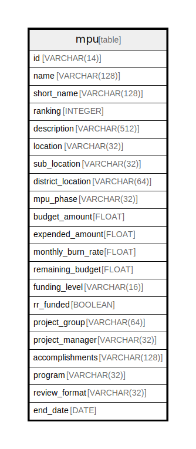

# mpu

## Description

<details>
<summary><strong>Table Definition</strong></summary>

```sql
CREATE TABLE mpu (
	id VARCHAR(14) NOT NULL, 
	name VARCHAR(128), 
	short_name VARCHAR(128), 
	ranking INTEGER, 
	description VARCHAR(512), 
	location VARCHAR(32), 
	sub_location VARCHAR(32), 
	district_location VARCHAR(64), 
	mpu_phase VARCHAR(32), 
	budget_amount FLOAT, 
	expended_amount FLOAT, 
	monthly_burn_rate FLOAT, 
	remaining_budget FLOAT, 
	funding_level VARCHAR(16), 
	rr_funded BOOLEAN, 
	project_group VARCHAR(64), 
	project_manager VARCHAR(32), 
	accomplishments VARCHAR(128), 
	program VARCHAR(32), 
	review_format VARCHAR(32), 
	end_date DATE, 
	PRIMARY KEY (id), 
	CHECK (rr_funded IN (0, 1))
)
```

</details>

## Columns

| Name | Type | Default | Nullable | Children | Parents | Comment |
| ---- | ---- | ------- | -------- | -------- | ------- | ------- |
| id | VARCHAR(14) |  | false |  |  |  |
| name | VARCHAR(128) |  | true |  |  |  |
| short_name | VARCHAR(128) |  | true |  |  |  |
| ranking | INTEGER |  | true |  |  |  |
| description | VARCHAR(512) |  | true |  |  |  |
| location | VARCHAR(32) |  | true |  |  |  |
| sub_location | VARCHAR(32) |  | true |  |  |  |
| district_location | VARCHAR(64) |  | true |  |  |  |
| mpu_phase | VARCHAR(32) |  | true |  |  |  |
| budget_amount | FLOAT |  | true |  |  |  |
| expended_amount | FLOAT |  | true |  |  |  |
| monthly_burn_rate | FLOAT |  | true |  |  |  |
| remaining_budget | FLOAT |  | true |  |  |  |
| funding_level | VARCHAR(16) |  | true |  |  |  |
| rr_funded | BOOLEAN |  | true |  |  |  |
| project_group | VARCHAR(64) |  | true |  |  |  |
| project_manager | VARCHAR(32) |  | true |  |  |  |
| accomplishments | VARCHAR(128) |  | true |  |  |  |
| program | VARCHAR(32) |  | true |  |  |  |
| review_format | VARCHAR(32) |  | true |  |  |  |
| end_date | DATE |  | true |  |  |  |

## Constraints

| Name | Type | Definition |
| ---- | ---- | ---------- |
| id | PRIMARY KEY | PRIMARY KEY (id) |
| sqlite_autoindex_mpu_1 | PRIMARY KEY | PRIMARY KEY (id) |
| - | CHECK | CHECK (rr_funded IN (0, 1)) |

## Indexes

| Name | Definition |
| ---- | ---------- |
| sqlite_autoindex_mpu_1 | PRIMARY KEY (id) |

## Relations



---

> Generated by [tbls](https://github.com/k1LoW/tbls)
