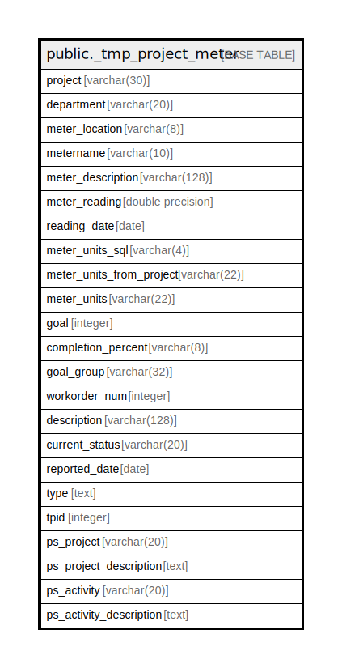

# public._tmp_project_meter

## Description

## Columns

| Name | Type | Default | Nullable | Children | Parents | Comment |
| ---- | ---- | ------- | -------- | -------- | ------- | ------- |
| project | varchar(30) |  | true |  |  |  |
| department | varchar(20) |  | true |  |  |  |
| meter_location | varchar(8) |  | true |  |  |  |
| metername | varchar(10) |  | true |  |  |  |
| meter_description | varchar(128) |  | true |  |  |  |
| meter_reading | double precision |  | true |  |  |  |
| reading_date | date |  | true |  |  |  |
| meter_units_sql | varchar(4) |  | true |  |  |  |
| meter_units_from_project | varchar(22) |  | true |  |  |  |
| meter_units | varchar(22) |  | true |  |  |  |
| goal | integer |  | true |  |  |  |
| completion_percent | varchar(8) |  | true |  |  |  |
| goal_group | varchar(32) |  | true |  |  |  |
| workorder_num | integer |  | false |  |  |  |
| description | varchar(128) |  | true |  |  |  |
| current_status | varchar(20) |  | true |  |  |  |
| reported_date | date |  | true |  |  |  |
| type | text |  | true |  |  |  |
| tpid | integer |  | false |  |  |  |
| ps_project | varchar(20) |  | true |  |  |  |
| ps_project_description | text |  | true |  |  |  |
| ps_activity | varchar(20) |  | true |  |  |  |
| ps_activity_description | text |  | true |  |  |  |

## Relations

---

> Generated by [tbls](https://github.com/k1LoW/tbls)
