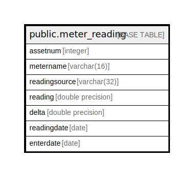

# public.meter_reading

## Description

## Columns

| Name | Type | Default | Nullable | Children | Parents | Comment |
| ---- | ---- | ------- | -------- | -------- | ------- | ------- |
| assetnum | integer |  | false |  |  |  |
| metername | varchar(16) |  | false |  |  |  |
| readingsource | varchar(32) |  | false |  |  |  |
| reading | double precision |  | false |  |  |  |
| delta | double precision |  | false |  |  |  |
| readingdate | date |  | false |  |  |  |
| enterdate | date |  | false |  |  |  |

## Constraints

| Name | Type | Definition |
| ---- | ---- | ---------- |
| meter_reading_pkey | PRIMARY KEY | PRIMARY KEY (assetnum, metername, readingsource, reading, delta, readingdate, enterdate) |

## Indexes

| Name | Definition |
| ---- | ---------- |
| meter_reading_pkey | CREATE UNIQUE INDEX meter_reading_pkey ON public.meter_reading USING btree (assetnum, metername, readingsource, reading, delta, readingdate, enterdate) |

## Relations

---

> Generated by [tbls](https://github.com/k1LoW/tbls)
