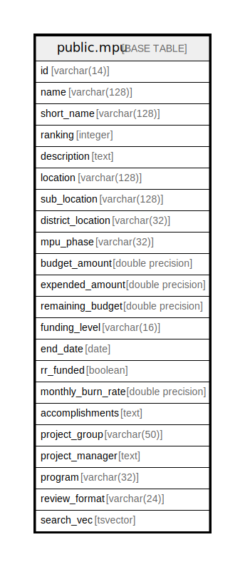

# public.mpu

## Description

## Columns

| Name | Type | Default | Nullable | Children | Parents | Comment |
| ---- | ---- | ------- | -------- | -------- | ------- | ------- |
| id | varchar(14) |  | false |  |  |  |
| name | varchar(128) |  | true |  |  |  |
| short_name | varchar(128) |  | true |  |  |  |
| ranking | integer |  | true |  |  |  |
| description | text |  | true |  |  |  |
| location | varchar(128) |  | true |  |  |  |
| sub_location | varchar(128) |  | true |  |  |  |
| district_location | varchar(32) |  | true |  |  |  |
| mpu_phase | varchar(32) |  | true |  |  |  |
| budget_amount | double precision |  | true |  |  |  |
| expended_amount | double precision |  | true |  |  |  |
| remaining_budget | double precision |  | true |  |  |  |
| funding_level | varchar(16) |  | true |  |  |  |
| end_date | date |  | true |  |  |  |
| rr_funded | boolean |  | true |  |  |  |
| monthly_burn_rate | double precision |  | true |  |  |  |
| accomplishments | text |  | true |  |  |  |
| project_group | varchar(50) |  | true |  |  |  |
| project_manager | text |  | true |  |  |  |
| program | varchar(32) |  | true |  |  |  |
| review_format | varchar(24) |  | true |  |  |  |
| search_vec | tsvector |  | true |  |  |  |

## Constraints

| Name | Type | Definition |
| ---- | ---- | ---------- |
| mpu_pkey | PRIMARY KEY | PRIMARY KEY (id) |

## Indexes

| Name | Definition |
| ---- | ---------- |
| mpu_pkey | CREATE UNIQUE INDEX mpu_pkey ON public.mpu USING btree (id) |

## Relations

---

> Generated by [tbls](https://github.com/k1LoW/tbls)
