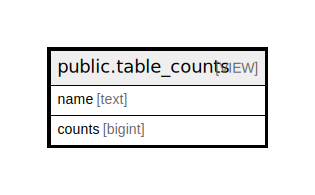

# public.table_counts

## Description

<details>
<summary><strong>Table Definition</strong></summary>

```sql
CREATE VIEW table_counts AS (
 SELECT 'asset'::text AS name,
    count(*) AS counts
   FROM asset
UNION ALL
 SELECT 'meter_reading'::text AS name,
    count(*) AS counts
   FROM meter_reading
UNION ALL
 SELECT 'work_order'::text AS name,
    count(*) AS counts
   FROM work_order
UNION ALL
 SELECT 'mpu'::text AS name,
    count(*) AS counts
   FROM mpu
)
```

</details>

## Columns

| Name | Type | Default | Nullable | Children | Parents | Comment |
| ---- | ---- | ------- | -------- | -------- | ------- | ------- |
| name | text |  | true |  |  |  |
| counts | bigint |  | true |  |  |  |

## Relations



---

> Generated by [tbls](https://github.com/k1LoW/tbls)
