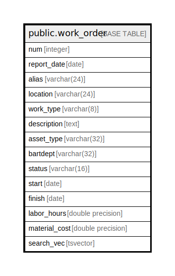

# public.work_order

## Description

## Columns

| Name | Type | Default | Nullable | Children | Parents | Comment |
| ---- | ---- | ------- | -------- | -------- | ------- | ------- |
| num | integer | nextval('work_order_num_seq'::regclass) | false |  |  |  |
| report_date | date |  | true |  |  |  |
| alias | varchar(24) |  | true |  |  |  |
| location | varchar(24) |  | true |  |  |  |
| work_type | varchar(8) |  | true |  |  |  |
| description | text |  | true |  |  |  |
| asset_type | varchar(32) |  | true |  |  |  |
| bartdept | varchar(32) |  | true |  |  |  |
| status | varchar(16) |  | true |  |  |  |
| start | date |  | true |  |  |  |
| finish | date |  | true |  |  |  |
| labor_hours | double precision |  | true |  |  |  |
| material_cost | double precision |  | true |  |  |  |
| search_vec | tsvector |  | true |  |  |  |

## Constraints

| Name | Type | Definition |
| ---- | ---- | ---------- |
| work_order_pkey | PRIMARY KEY | PRIMARY KEY (num) |

## Indexes

| Name | Definition |
| ---- | ---------- |
| work_order_pkey | CREATE UNIQUE INDEX work_order_pkey ON public.work_order USING btree (num) |

## Relations

---

> Generated by [tbls](https://github.com/k1LoW/tbls)
