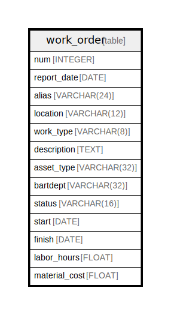

# work_order

## Description

<details>
<summary><strong>Table Definition</strong></summary>

```sql
CREATE TABLE work_order (
	num INTEGER NOT NULL, 
	report_date DATE, 
	alias VARCHAR(24), 
	location VARCHAR(12), 
	work_type VARCHAR(8), 
	description TEXT, 
	asset_type VARCHAR(32), 
	bartdept VARCHAR(32), 
	status VARCHAR(16), 
	start DATE, 
	finish DATE, 
	labor_hours FLOAT, 
	material_cost FLOAT, 
	PRIMARY KEY (num)
)
```

</details>

## Columns

| Name | Type | Default | Nullable | Children | Parents | Comment |
| ---- | ---- | ------- | -------- | -------- | ------- | ------- |
| num | INTEGER |  | false |  |  |  |
| report_date | DATE |  | true |  |  |  |
| alias | VARCHAR(24) |  | true |  |  |  |
| location | VARCHAR(12) |  | true |  |  |  |
| work_type | VARCHAR(8) |  | true |  |  |  |
| description | TEXT |  | true |  |  |  |
| asset_type | VARCHAR(32) |  | true |  |  |  |
| bartdept | VARCHAR(32) |  | true |  |  |  |
| status | VARCHAR(16) |  | true |  |  |  |
| start | DATE |  | true |  |  |  |
| finish | DATE |  | true |  |  |  |
| labor_hours | FLOAT |  | true |  |  |  |
| material_cost | FLOAT |  | true |  |  |  |

## Constraints

| Name | Type | Definition |
| ---- | ---- | ---------- |
| num | PRIMARY KEY | PRIMARY KEY (num) |

## Relations



---

> Generated by [tbls](https://github.com/k1LoW/tbls)
